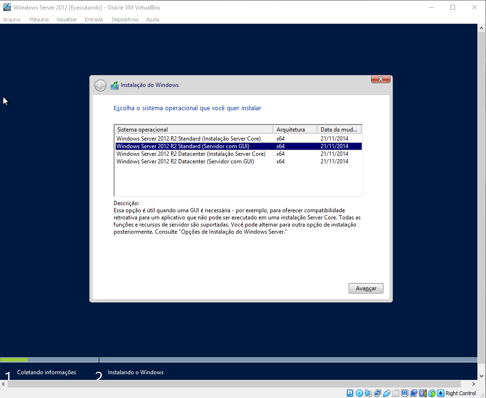

## Manual de Instalação do Windows Server 2012.

Neste manual, você encontrará todas as informações necessárias para instalar, configurar e operar no Windows Server 2012.

**Requisitos:**

**1° Passo:** *Iremos iniciar a máquina, e aparecerá a seguinte aba:*

*Nessa aba, você escolherá em qual idioma deseja que sua máquina atue e irá clicar na opção que aparece no canto inferior a direita, escrito "Avançar".*

**2° Passo:** *Após avançar, a aba que aparecerá será a seguinte:*

*Nesse momento iremos seguir alguns passos para concluir a instalação da nossa máquina, para seguirmos, clique na opção ao centro "Instalar agora".*

**3° Passo:** *Nesse momento, abrirá em sua tela, uma aba na qual aparecerá as seguintes opções:*

*Olhando para isso a nossa cabeça da um nó né? Mas, relaxa que irei te mostrar qual opção escolher!*

*Exatamente, essa opção! As vezes é ruim ser segunda opção, mas garanto, que nesse caso será bom. Clique em "Avançar, e bora para o próximo passo.*

**4° Passo:** *Nessa aba você aceitará os termos e clicará em "Avançar".

*Esse passo é simples né? Vamos continuar!*

**5° Passo:** *Se você chegou nesse passo, sua tela estará assim:*

*Segunda opção de novo? Sim!😬*
*Não é ruim, calma ai!🤏🏻*
*Chega de enrolação, vamos para o próximo logo.*

**6° Passo:** *A próxima aba é essa aqui ó:*

*Nessa aqui você clicará ali em "Novo" e abrirá uma caixa cheia de número, essa aqui:*

*O número que aparecerá é totalmente aleatório, então você colocará "**51200**". Após alterar o valor, clique em "Avançar".*
*E aperte em "OK", quando aparecer a seguinte mensagem:*

**7° Passo:** *Agora, na seguinte aba, você escolherá a seguite opção:*
 
*Aperte na opção sugerida e avance!*

**8° Passo:** *Agora basta esperar carregar até os 100% e logo terá acesso a sua grande máquina.*

**9° Passo:** *Esse momento é para sua segurança, então coloque uma senha forte e que você não esqueça!*

*Finalmente podemos clicar em "Concluir" e acessar a nossa máquina.*

**10° Passo:** *Clicando na tecla "Ctrl" localizada do lado inferior direito do seu teclado e na "Delete", iniciamos essa maravilha.*

**11° Passo:** *Digitando sua senha e apertando "Enter", teremos acesso ao nosso Sistema Operacional Windows Server 2012.*

*É agora!!!*

**🙌🏼FINALMENTE!!🙌🏼**

*Gostaria de expressar meu sincero agradecimento por escolher nosso manual. Espero que o mesmo tenha sido útil para você compreender e utilizar todas as funcionalidades do Windows Server 2012. Obrigada pela confiança e desejo uma excelente experiência com esse Sistema Operacional!*

